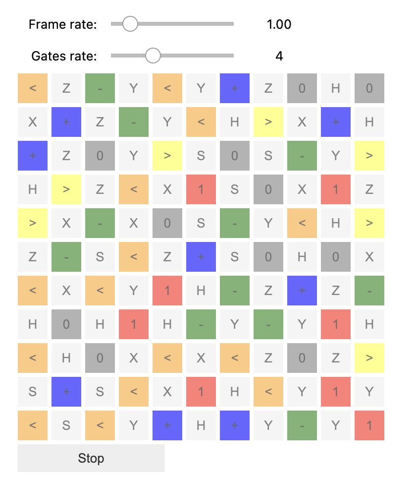

# Qubit evolution

## Idea
1. A board show qubits with gates neighbors.  
2. Qubit states are 0, 1, +, -, < (left), > (right).
3. In each cycle, apply the neighborhood gates on the qubits in sequence (up, right, down and left).
4. One may experience the visualization effect by changing the frame rate and gate change rate.

## Screenshot

## Game parameters

The following global variables may be modified.

1. SCREEN_X and SCREEN_Y: change the board size

## Implementation

1. Use ipywidgets so that it can be run inside browser or vscode with jupyter.
